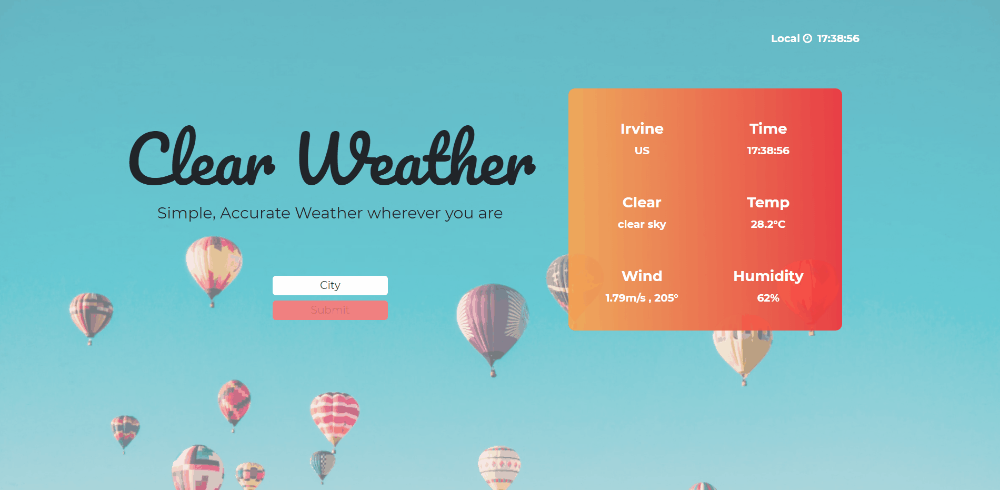

# world-clock
> - Maintained by: `kusholhuq`

## Description
A dynamic web app that tells time and weather in cities across the globe.

## Live Demo
https://clear-weather.kusholhuq.com/


## Technologies Used
  - HTML5
  - CSS3
  - JavaScript (ES6)
  - jQuery
  - Bootstrap4
  - Node.js
  - Express
  - Node Fetch
  - dotenv
  - NPM
  - AWS EC2
  - [**Open Weather API**](https://openweathermap.org/current)
  - [**Google Time Zone API**](https://developers.google.com/maps/documentation/timezone/start?utm_source=google&utm_medium=cpc&utm_campaign=FY18-Q2-global-demandgen-paidsearchonnetworkhouseads-cs-maps_contactsal_saf&utm_content=text-ad-none-none-DEV_c-CRE_433476780412-ADGP_Hybrid+%7C+AW+SEM+%7C+SKWS+~+Time+Zone+API-KWID_43700039136946363-kwd-538188851010-userloc_9061184&utm_term=KW_%2Btime%20%2Bzone%20%2Bapi-ST_%2Btime+%2Bzone+%2Bapi&gclid=EAIaIQobChMIlfKxp8q-6QIVfPvjBx2Spw0_EAAYASAAEgJuYPD_BwE)

  ## Features
 1. User can view weather from city of choice.
 1. User can view local time.
 1. User can view time from city of choice.

 ## Preview
 

 ## Development

 ### System Requirements
- NPM 6 or higher
- Node.js 10 or higher

 ### API Requirements
 To run this app locally, you will need [**OpenWeather**](https://openweathermap.org/current) and [**Google Time Zone**]((https://developers.google.com/maps/documentation/timezone/start?utm_source=google&utm_medium=cpc&utm_campaign=FY18-Q2-global-demandgen-paidsearchonnetworkhouseads-cs-maps_contactsal_saf&utm_content=text-ad-none-none-DEV_c-CRE_433476780412-ADGP_Hybrid+%7C+AW+SEM+%7C+SKWS+~+Time+Zone+API-KWID_43700039136946363-kwd-538188851010-userloc_9061184&utm_term=KW_%2Btime%20%2Bzone%20%2Bapi-ST_%2Btime+%2Bzone+%2Bapi&gclid=EAIaIQobChMIlfKxp8q-6QIVfPvjBx2Spw0_EAAYASAAEgJuYPD_BwE)) accounts and API keys.

 ### Getting Started
 If you would like to use this application locally, please follow the steps below:

 1. Clone the repository
    ``` bash
    git clone https://github.com/kusholhuq/world-clock
    cd world-clock
    ```
2. Install all dependencies with **NPM**.

   ```shell
   npm install
   ```
3. Create a new **.env** file in the root directory of the project that will house your server port and **Google API key**.

   ```shell
   touch .env
   ```
4. In your new file, add the information below,    replacing the value of ```WEATHER_KEY``` and ```TIME_KEY``` with your personal api keys. Save the changes to your **.env** file.

   ```
   PORT=3000
   WEATHER_KEY=(your api key here)
   TIME_KEY=(your api key here)
   ```

5. Start your **Node** server.

   ```shell
   npm run start
   ```

6. In your browser, navigate to [http://localhost:3000](http://localhost:3000).
