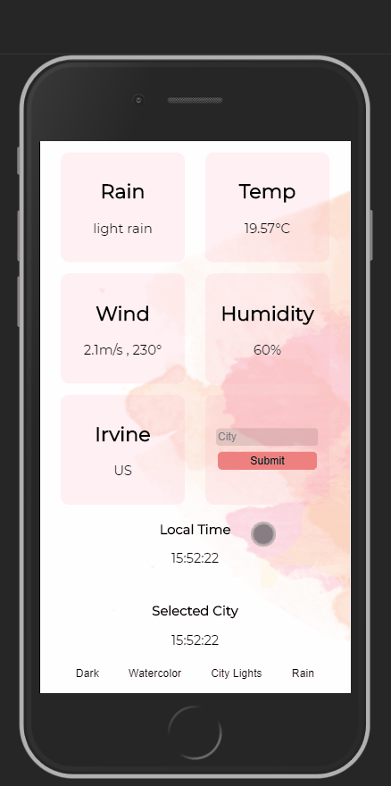

# world-clock
> - Maintained by: `kusholhuq`
## Description
A mobile first web app that tells time and weather in cities across the globe.

## Live Demo
https://world-clock.kusholhuq.com/


## Technologies Used
  - HTML5
  - CSS3
  - JavaScript (ES6)
  - jQuery
  - [**Open Weather API**](https://openweathermap.org/current)
  - [**Google Time Zone API**](https://developers.google.com/maps/documentation/timezone/start?utm_source=google&utm_medium=cpc&utm_campaign=FY18-Q2-global-demandgen-paidsearchonnetworkhouseads-cs-maps_contactsal_saf&utm_content=text-ad-none-none-DEV_c-CRE_433476780412-ADGP_Hybrid+%7C+AW+SEM+%7C+SKWS+~+Time+Zone+API-KWID_43700039136946363-kwd-538188851010-userloc_9061184&utm_term=KW_%2Btime%20%2Bzone%20%2Bapi-ST_%2Btime+%2Bzone+%2Bapi&gclid=EAIaIQobChMIlfKxp8q-6QIVfPvjBx2Spw0_EAAYASAAEgJuYPD_BwE)

  ## Features
 1. User can view weather from city of choice.
 1. User can view local time.
 1. User can view time from city of choice.
 1. User can select theme of their liking.

 ## Preview
 

 ## Development
 ### Getting Started
 1. Clone the repository
    ``` bash
    git clone https://github.com/kusholhuq/world-clock
    cd world-clock
    ```
 1. Open the project in your default browser
